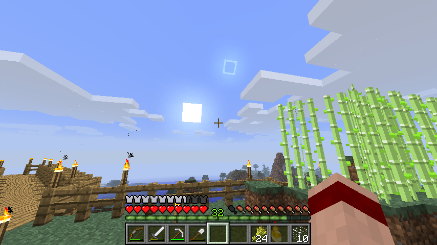

# Fixed Moon Phases Mod for Minecraft

A mod to make moon phases in Minecraft astronomically accurate.

Written by Gregory Paciga <<moon@greg.paciga.com>>.




## Installation

1. In your `.minecraft/versions` folder, copy the `1.6.2` directory to a
   new one with a new name (such as `1.6.2.moon`), rename both files in
   it to match, and change the first line of the `.json` file so that `id`
   matches.

2. Put the `bfi.class` file into the new `.jar` file, and delete the
   `META_INF` directory.

3. In the Minecraft launcher, edit your profile to use the new version
   you've created.


## Rationale

Vanilla Minecraft does have moon phases, but they are physically
impossible. Since the moon is always directly opposite the sun, there
should always be a full moon.

```
 [SUN]                   [MINECRAFT WORLD]      [MOON]
```

In order to get phases, the moon has to move relative to the sun. To
have the moon only half lit, it has to be 90 degrees away from the sun
(not 180) so you see half the lit side and half the dark side, like
so:

```
                           [QUARTER MOON]
                  bright side <- | -> dark side

 [SUN]                   [MINECRAFT WORLD]
```

In this position, you can see that the waning quarter moon should
actually be at the zenith (straight overhead) at sunrise!  The new
moon actually rises at the same time as the sun, like so:

```
 [SUN]               [NEW MOON]            [MINECRAFT WORLD]
          bright side <- | -> dark side
```

This mod makes two simple changes to make the moon phases realistic:

1. The position of the moon changes as a function of time, such that
   it orbits around the Minecraft world once per 8 days (a full lunar
   cycle) rather than remaining stationary opposite the sun.

2. The moon texture is rotated by 90 degrees, such that the lit
   portion of the moon is the side closest to the sun. This mod does
   not change the texture itself, so other textures should still work
   fine, as long as they look ok sideways.


## No eclipses

To avoid the new moon always being directly in front of the sun every
time, I've added a slight tilt to the moon's orbit. On Earth, this
tilt is 5 degrees. In Minecraft, since the Sun and Moon are much
bigger in the sky than their real life counterparts, I made the tilt
about 17 degrees.

In the real world, the direction of the tilt changes as the Earth
orbits the Sun.  Basically this means that at some points of the year,
the new moon will be north of the sun, and sometimes it will be south
of the sun. Only twice a year will it be at the same level as the Sun,
making a solar eclipse possible.

I've done something similar here, with a period of exactly 6 lunar
cycles (48 days). If today the new moon is at its maximum distance (17
degrees) north of the sun, in 24 days it will be at its maximum
distance south. You might think of this 48 day period as a "minecraft
year". (Technically, it is a "minecraft draconic year" or "minecraft
eclipse year".)

I could have chosen any length for this period, but at exactly 6 lunar
cycles, the new moon will never be exactly in front of the sun. There
are no solar eclipses in Minecraft.

## Telling Time

The moon can't be used to tell the time of night as easily
anymore. Previously, the position of the moon in the sky told you
exactly how long it was until morning, since moonset and sunrise
happened at the same time. Now, the moon sets slightly later each day,
and you have to take that into account when judging how long it is
until morning. There will be plenty of times at night when the moon
isn't up at all.

If you're clever, you might identify a particular group of stars that
sets at sunrise to use instead of the moon. This is because, even
though I've made it so the moon orbits the minecraft world, the
minecraft world still doesn't orbit the sun. The sun and the stars
remain fixed (for now).

While there may not be a *solar* year, there is still the
draconic/eclipse year described above, and you *can* use the moon to
tell what time of that year it is, based on how far away from the sun
the new moon is.


## Direction

Since the orbit has a slight tilt to it, you also can't use the moon
as a compass as easily either. The sun is still always due east/west,
but the moon will be as much as 17 degrees away from east/west.
Luckily that's still small enough that you can use the moon to get the
general direction, and then just pay attention to the blocks to
find the true due east/west direction.


## Even more accurate astronomy

Some things that would be great to add to make this even more accurate:

- Some control of the light level depending on whether the moon is
  actually up or not.

- Make it get darker when the moon crosses the sun. I've avoided it
  for now by chosing an eclipse year that makes eclipses impossible,
  but if I can add this I would make eclipses happen.

- Change the rotation of the sky depending on how far north or south
  you are.

- Change time depending on how far east or west you go.


## Bugs

If you have problems of any sort, email <moon@greg.paciga.com>.

